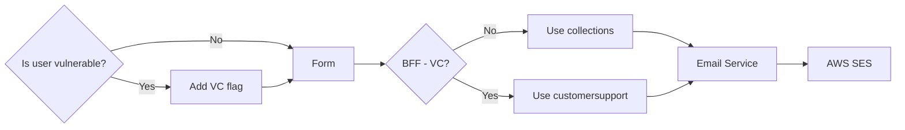

# Architecture

_can't get much simpler, can it now_

```mermaid
flowchart LR
  VC{Is user vulnerable?}-->|Yes| Extra
  VC{Is user vulnerable?}-->|No| Form
  Extra[Add VC flag]-->Form
  Form-->BFF{BFF - VC?}
  BFF-->|Yes| Customer
  BFF-->|No| Collections
  Collections[Use collections]-->emailService
  Customer[Use customersupport]-->emailService
  emailService[Email Service]-->SES[AWS SES]
```

<!-- ./components/SelfPromo.vue -->
<SelfPromo />

<!--
- Welcome
-->
